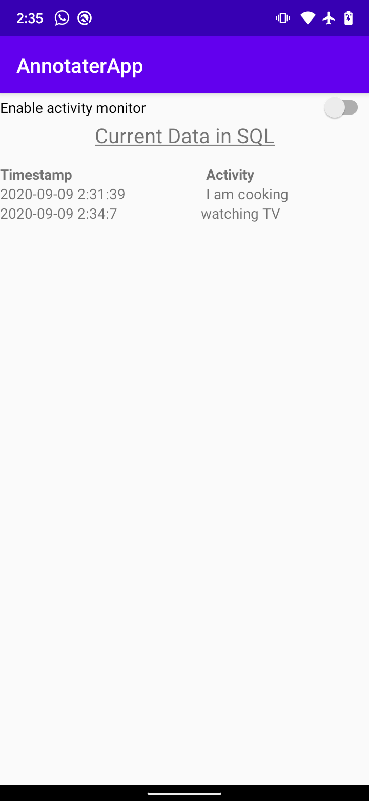

# annotater_app

For our work using sensor data for activity recognition, we need people to carry phones and wear smartwatches and label what they do. This labeling task is a pain. Usually we have the phone beep that a survey is ready, and someone takes out the phone and enters data about their activity or context by answering a multiple-choice survey.

We want to have an app that allows us to get the activity data more easily. In particular, we want someone to be able to just say what they are doing. This could happen in two ways:

- Method 1: The app beeps (using a schedule we would define … for testing we would use once within every 10 minute block of time, randomly within the block). At the beep, the app would be listening for audio input. It would listen for a short time, then process the audio for keywords. It would check the keywords against a library of acceptable words. The interaction would be as follows. Phone beeps and listens; person says “I’m using the computer”; app processes words and looks for words or phrases in the master list it knows, such as “using a computer” and matches. It saves the time of the prompt, all the words recognized, and the known keywords recognized, as well as the raw audio clip. The goal is to allow the person to say what he or she is doing naturally and have the app be reasonably forgiving to identify keywords of interest. For example, keywords (which should be defined in a text file the app loads), might be grouped together. E.g., “I’m cooking” “cooking” “cooking pasta” “making dinner” might all be flagged as “cook” or “meal preparation.” Note that the speech recognition system will make many errors, and gracefully handling those will be important.

- Method 2: The user proactively starts the labeling. This would be best done by using the “Ok, Google” to wake up the device and then say “Activity … Cooking” or something like that. “Ok, Google … Activity …. Using the computer.”

With either strategy, the implementation needs to be such that it will not destroy the battery life of the device. The annotation app cannot be required to stay in the foreground; someone must be able to use the phone normally while the app is running.

Overall, the goal is to make labeling what someone is doing as painless as possible, in the midst of the person’s everyday life, either when the person thinks of it (method 2), or when the app prompts (method 1).

Extension #1

We want to find a Bluetooth headset that someone can wear during the day and interact with the system above. The idea is the person would hear a beep in their ear, could say what activity is being performed, and then go on with whatever was already going on. This would allow very simple, and very frequent, labeling of activity. The trick here is to find a headset that has good battery life in standby and that will not go to sleep, so that this system can run for hours (about an 18 hour waking day) without the user having to push a button on the headset to keep waking it back up.

Future extensions

We will start with the phone, but then it would be outstanding if the app also worked with an Android Wear watch. If we are able to get this working on phones and watches, we might even try to make it work on Google Glass eventually, as a neat demonstration of the future. 

### Proof of working

#### 15 minute auto start
```
09-09 00:57:55.335 23100 25443 D ListenWorker: doWork
09-09 00:57:55.346 23100 25429 I WM-WorkerWrapper: Worker result SUCCESS for Work [ id=5d04a82f-87a5-463a-82c6-d009fe09af43, tags={ com.northeastern.annotaterapp.worker.ListenWorker } ]
09-09 00:57:55.360 23100 23100 D AskService: Service started!
09-09 00:57:55.368 23100 23100 D IAskRecorderImpl: getOneSentence
09-09 00:57:55.368 23100 23100 D AskService: listening...
09-09 00:57:55.646 23100 23100 V Listener: onReadyForSpeech
09-09 00:57:57.414 23100 23100 V Listener: onBeginningOfSpeech
09-09 00:57:58.445 23100 23100 V Listener: onEndofSpeech
09-09 00:57:58.533 23100 23100 D Listener: Speech recognition results obtained!
09-09 00:57:58.533 23100 23100 V Listener: =====================================
09-09 00:57:58.535 23100 23100 V Listener: 1. hello
09-09 00:57:58.535 23100 23100 D AskService: hello
09-09 00:57:58.536 23100 23100 D LogTableUtils: Pushing into the log table!
09-09 00:57:58.582 23100 23100 V Listener: =====================================
09-09 00:57:58.582 23100 23100 D AskService: onDestroy
09-09 01:12:55.397 23100 25437 D ListenWorker: ListenWorker
09-09 01:12:55.411 23100 27145 D ListenWorker: doWork
09-09 01:12:55.426 23100 23100 D AskService: Service started!
09-09 01:12:55.434 23100 25429 I WM-WorkerWrapper: Worker result SUCCESS for Work [ id=5d04a82f-87a5-463a-82c6-d009fe09af43, tags={ com.northeastern.annotaterapp.worker.ListenWorker } ]
09-09 01:12:55.460 23100 23100 D IAskRecorderImpl: getOneSentence
09-09 01:12:55.461 23100 23100 D AskService: listening...
09-09 01:12:55.583 23100 23100 V Listener: onReadyForSpeech
09-09 01:12:56.707 23100 23100 V Listener: onBeginningOfSpeech
09-09 01:12:59.585 23100 23100 V Listener: onEndofSpeech
09-09 01:12:59.706 23100 23100 D Listener: Speech recognition results obtained!
09-09 01:12:59.706 23100 23100 V Listener: =====================================
09-09 01:12:59.708 23100 23100 V Listener: 1. oh just work
09-09 01:12:59.708 23100 23100 D AskService: oh just work
09-09 01:12:59.708 23100 23100 D LogTableUtils: Pushing into the log table!
09-09 01:12:59.776 23100 23100 V Listener: =====================================
09-09 01:12:59.776 23100 23100 D AskService: onDestroy
```

#### invalid input & no input test
```
09-09 02:26:12.524 32454  4931 D ListenWorker: doWork
09-09 02:26:12.530 32454  4928 I WM-WorkerWrapper: Worker result SUCCESS for Work [ id=b13aef54-54f9-476f-a65a-8ef630b36f87, tags={ com.northeastern.annotaterapp.workers.ListenWorker, asker } ]
09-09 02:26:12.541 32454 32454 D AskService: Service started!
09-09 02:26:12.549 32454 32454 D IAskRecorderImpl: getOneSentence
09-09 02:26:12.550 32454 32454 D AskService: listening...
09-09 02:26:12.672 32454 32454 V Listener: onReadyForSpeech
09-09 02:26:13.786 32454 32454 V Listener: onBeginningOfSpeech
09-09 02:26:14.564 32454 32454 V Listener: onEndofSpeech
09-09 02:26:14.653 32454 32454 V Listener: error 7
09-09 02:26:14.653 32454 32454 D AskService: Error 7 (NO_INPUT) retrying!
09-09 02:26:14.653 32454 32454 D AskService: Retrying 1 out of 3 times
09-09 02:26:14.654 32454 32454 D IAskRecorderImpl: getOneSentence
09-09 02:26:14.654 32454 32454 D AskService: listening...
09-09 02:26:14.718 32454 32454 V Listener: onReadyForSpeech
09-09 02:26:15.971 32454 32454 V Listener: onBeginningOfSpeech
09-09 02:26:17.950 32454 32454 V Listener: onEndofSpeech
09-09 02:26:18.040 32454 32454 D Listener: Speech recognition results obtained!
09-09 02:26:18.040 32454 32454 V Listener: =====================================
09-09 02:26:18.043 32454 32454 V Listener: 1. cleaning
09-09 02:26:18.044 32454 32454 D AskService: Invalid activity!
09-09 02:26:18.044 32454 32454 D AskService: Retrying 2 out of 3 times
09-09 02:26:18.044 32454 32454 D IAskRecorderImpl: getOneSentence
09-09 02:26:18.044 32454 32454 D AskService: listening...
09-09 02:26:18.044 32454 32454 V Listener: =====================================
09-09 02:26:18.140 32454 32454 V Listener: onReadyForSpeech
09-09 02:26:20.412 32454 32454 V Listener: onBeginningOfSpeech
09-09 02:26:22.015 32454 32454 V Listener: onEndofSpeech
09-09 02:26:22.096 32454 32454 D Listener: Speech recognition results obtained!
09-09 02:26:22.097 32454 32454 V Listener: =====================================
09-09 02:26:22.098 32454 32454 V Listener: 1. I am cooking
09-09 02:26:22.099 32454 32454 D AskService: Valid data [I am cooking] obtained
09-09 02:26:22.100 32454 32454 D LogTableUtils: Pushing into the log table!
09-09 02:26:22.153 32454 32454 V Listener: =====================================
09-09 02:26:22.153 32454 32454 D AskService: onDestroy
```

### Screenshots

